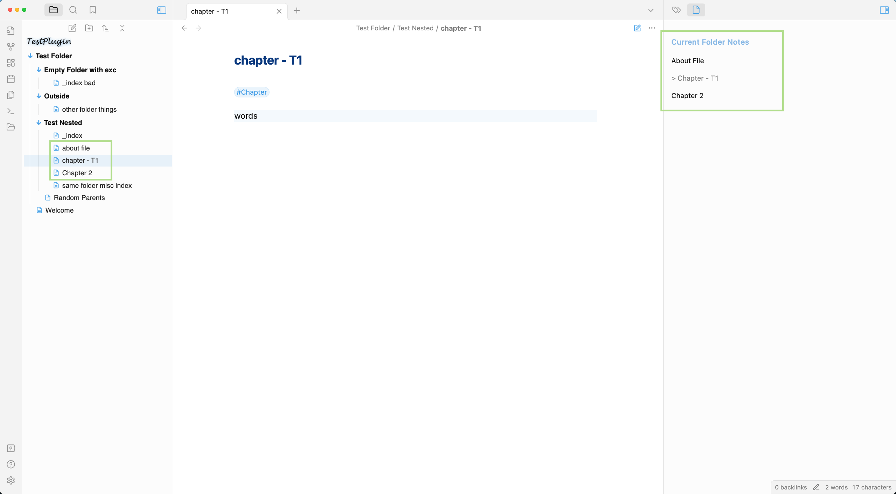

# Current Folder Notes Pane 

I use this to show a list of chapters + about files for my novel writing since my writing projects are usually contained in one folder. It sorts the list of chapter e.g. 'Chapter T1 - Hello World', 'Chapter T2 - Running'...

You can filter out some notes such as 'index' that you don't want to see in the listing, and only include in a list of notes that have 'chapter' or 'about' in them.

How this works

Example Settings

## Manually installing the plugin

- Copy over `main.js`, `styles.css`, `manifest.json` to your vault `VaultFolder/.obsidian/plugins/your-plugin-id/`.

