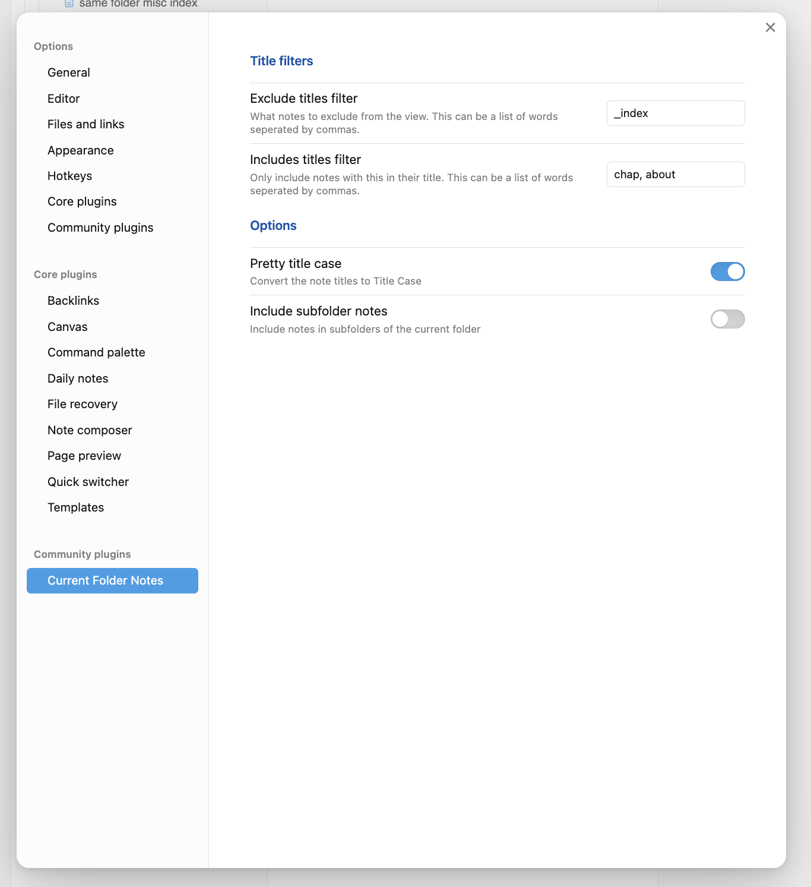

# 📂 Current Folder Notes Pane 

Welcome to **Current Folder Notes Pane**—an Obsidian plugin designed to transform how you organize and navigate your writing projects! This plugin is perfect for writers who keep their chapters and related files within a single folder.

## ✨ What Is It?

Imagine having a specialized sidebar that shows just the notes you care about from your current folder, intelligently sorted by chapter numbers. Current Folder Notes does exactly that by providing a clean, focused view of your writing project.

## 🌟 Key Features

- 📋 **Smart Note Listing**: Automatically lists and sorts notes in your current folder (perfect for chapter organization like "Chapter T1 - Hello World", "Chapter T2 - Running"...)
- 🔍 **Powerful Filtering**: Include only the notes that matter (like chapters or about files) and exclude others (like index files)
- ✏️ **Pretty Title Case**: Option to automatically format your note titles in Title Case for better readability
- 📚 **Outline Integration**: View headings from your current file or all files right in the pane
- 📁 **Subfolder Support**: Optionally include notes from subfolders
- ⭐ **Visual Indicators**: Current file is highlighted with a star for quick identification

## 🚀 How to Use

1. **Open the Pane**: Click the folder icon in the ribbon or use the command "Open Pane"
2. **Navigate Your Project**: Click on any file in the list to open it
3. **Jump to Headings**: Click on any heading in the outline to jump directly to that section

Perfect for:
- 📝 Novel writing with multiple chapters
- 🎓 Research projects with related notes
- 📊 Any project where you need to see a focused list of related files

## ⚙️ Settings

Customize Current Folder Notes to perfectly match your workflow:

- **Exclude Titles Filter**: Hide specific notes (e.g., "_index" files)
- **Include Titles Filter**: Only show notes containing specific words (e.g., "chapter", "about")
- **Pretty Title Case**: Toggle automatic title formatting for better readability
- **Include Subfolder Notes**: Choose whether to include notes from subfolders
- **Current File Outline**: Show headings from your active file
- **All Files Outline**: Show headings from all files in the folder

## 📋 Example Settings

Perfect for writers organizing a novel project:

## 💻 Installation

### Community Plugins (Coming Soon)
1. Open Settings > Community plugins
2. Click "Browse"
3. Search for "Current Folder Notes"
4. Click "Install"
5. Once installed, enable the plugin

### Manual Installation

- Copy over `main.js`, `styles.css`, `manifest.json` to your vault `VaultFolder/.obsidian/plugins/current-folder-notes/`
- Restart Obsidian
- Enable the plugin in Settings > Community plugins

## 💡 Tips for Writers

- Use a consistent naming convention for your chapters (e.g., "Chapter T1 - Introduction")
- Create an "about-characters" or "about-settings" file to keep track of your world-building
- Use headings within your chapters for easy navigation via the outline feature

## ❓ Questions or Feedback?

Love the plugin? Found a bug? Have a feature request? Feel free to reach out!

Enjoy organizing your writing projects with Current Folder Notes Pane!

